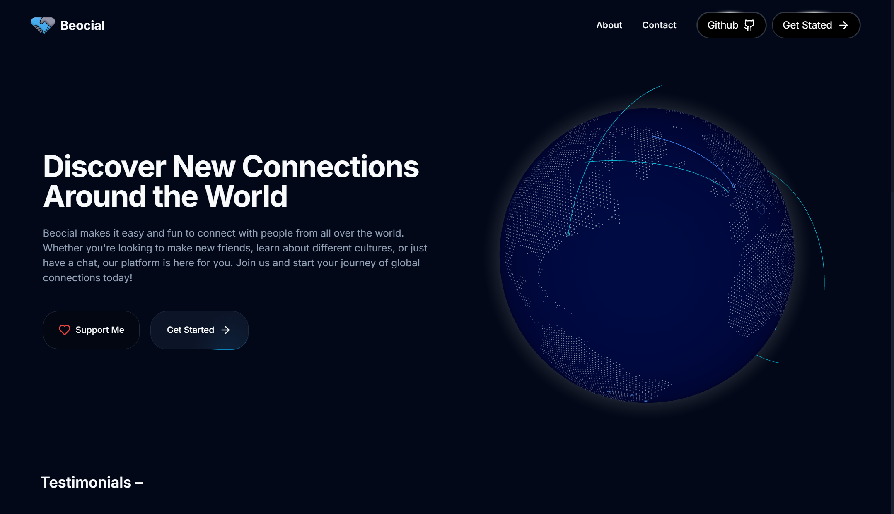

# Beocial

Beocial is a sleek, open-source video chat platform that connects people globally at random. Enjoy effortless video communication without the need for sign-up or login. Experience a beautiful, user-friendly interface on any device.

## Features

- **Random One-to-One Video Chat**: Meet new people through random video chats.
- **Clean and Modern UI**: Enjoy a sleek, easy-to-navigate interface.
- **Privacy Focused**: No user information is stored, ensuring your privacy.
- **Accessible on All Devices**: Works seamlessly across desktops, tablets, and smartphones.
- **Open-Source**: Free to use and contribute to, with a vibrant community.

## Quality and Best Practices

- **High-Quality Code**: Developed with Next.js 14 and TypeScript to ensure reliability and performance.
- **Secure**: Follows best security practices to protect user data and privacy.
- **Responsive Design**: Optimized for all device sizes and screen resolutions.
- **Active Maintenance**: Regular updates and improvements based on community feedback and security reviews.

## Contributing

We welcome contributions from the community! Please refer to our [Contributing Guidelines](CONTRIBUTING.md) for information on how to get started, including setup instructions and development practices.

## License

This project is licensed under the MIT License. See the [LICENSE](LICENSE) file for more details.

## Contact

For any questions or feedback, feel free to reach out to us at [aadarshgurug@gmail.com](mailto:aadarshgurug@gmail.com).

---

Thank you for your interest in Beocial. We hope you enjoy using the app and look forward to your contributions!